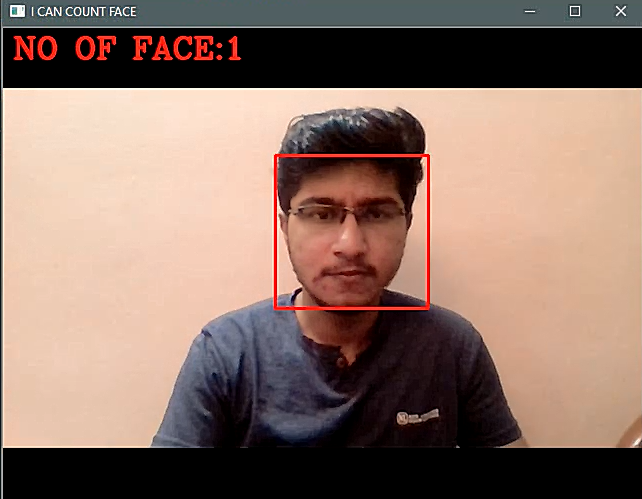
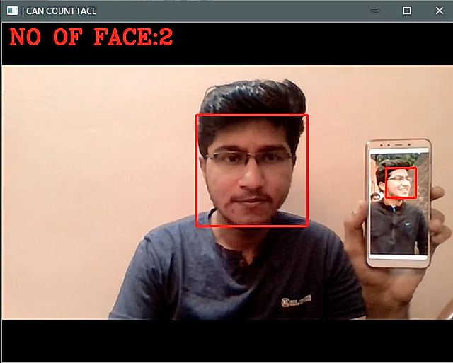

# Face_Count
hey, This python progrom is a image processing program with the openCV module for python.

This python program is used to find the number of faces in the video, the video stream is obtained form the webcam of laptop.

You need to install the opencv version 3 or higher to run this program.

Here are some example image.

